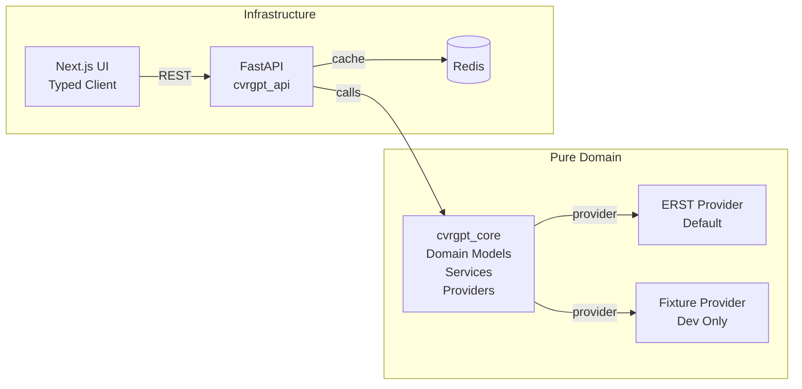

# CVRGPT v2 — Layered Architecture with Core Package

**Production-ready MVP for chat-like exploration of Danish company data (CVR) with clean domain-driven architecture, typed APIs, and modern frontend.**

## Quick Start (5 minutes)

### Prerequisites
- Python 3.11+
- Node.js 20+
- Docker (optional, for Redis caching)

### Backend Setup

```powershell
# Start Redis (optional)
docker compose up -d

# Backend
cd server
python -m venv .venv
.\.venv\Scripts\Activate.ps1
pip install -r requirements.txt

# Environment (optional)
cp .env.example .env.local
# Edit .env.local with your settings

# Start API server
$env:PYTHONPATH = "src"
uvicorn cvrgpt_api.api:app --reload --port 8000
```

### Frontend Setup

```powershell
# In a new terminal
cd frontend
npm ci
npm run dev
```

### Quick Test

```bash
# Backend tests
cd server
pytest -q

# Frontend type check
cd frontend
npm run type-check

# All checks
make lint
make typecheck
make test
```

## Data Providers

**ERST/Datafordeler is the default and primary source.**  
The application is wired to use ERST in all non-dev environments. If ERST credentials are missing, the server will **fail closed** on startup to avoid silently serving stale/fixture data.

### Environment

```ini
APP_ENV=dev|prod
DATA_PROVIDER=erst        # default
ERST_CLIENT_ID=...
ERST_CLIENT_SECRET=...
ERST_AUTH_URL=...
ERST_TOKEN_AUDIENCE=...
ERST_API_BASE_URL=...
ERST_CERT_PATH=...        # optional
ERST_KEY_PATH=...         # optional
API_KEY=...
```

### Healthcheck

Verify provider readiness:

```bash
curl -H "X-API-Key: $API_KEY" http://localhost:8000/health/provider
# { "provider": "erst", "ok": true }
```

### Local development

For local tinkering you can still use the fixture provider:

```bash
APP_ENV=dev DATA_PROVIDER=fixture uvicorn cvrgpt_api.api:app --reload
```

### Chat answers & provenance

All chat answers are grounded in provider data. In production, **ERST is the always-on provider**; numbers are never hallucinated and are returned with their reporting period. If a tool is temporarily unavailable, the app will return a partial answer and clearly state which source was unavailable.

## Architecture



## API Endpoints

All API endpoints are versioned under `/v1/` and require an `x-api-key` header:

| Endpoint | Method | Description | Response |
|----------|---------|-------------|----------|
| `/v1/search?q={query}` | GET | Search companies by name or CVR | `SearchResponse` |
| `/v1/company/{cvr}` | GET | Get company details | `CompanyResponse` |
| `/v1/filings/{cvr}` | GET | List company filings | `FilingsResponse` |
| `/v1/accounts/latest/{cvr}` | GET | Get latest accounts | `AccountsResponse` |
| `/v1/compare/{cvr}` | GET | Compare accounts over time | `CompareResponse` |
| `/v1/compare/{cvr}/export` | GET | Export comparison as CSV | CSV file |
| `/v1/events` | GET | List events with filtering | `EventsResponse` |
| `/v1/tools/run` | POST | Execute tools (agent surface) | `ToolResponse` |
| `/v1/chat` | POST | Chat with structured blocks | `ChatResponse` |
| `/healthz` | GET | Health check | `{"status": "ok"}` |

### Chat & Events Features

The new endpoints provide:

- **Events API**: Filter bankruptcy events by type, NACE codes, and date ranges
- **Tools System**: Extensible tool execution framework for agent capabilities  
- **Chat Interface**: Natural language processing for company data exploration

**Environment variables (frontend - server-side only):**
- `CVRGPT_API_URL=http://localhost:8000` (backend API URL)
- `CVRGPT_API_KEY=dev-key` (match your backend dev key)

**Environment variables (backend):**
- `LLM_ENABLED=false` (MVP uses deterministic parsing)
- `ERST_EVENTS_REAL=0` (set to 1 to enable real ERST API calls)
- `ACCOUNTS_REAL=0` (set to 1 to enable real iXBRL/PDF extraction)
- Optionally later:
  - `LLM_PROVIDER=openai`
  - `LLM_MODEL=gpt-4o-mini`
  - `OPENAI_API_KEY=...`

**Happy-path smoke commands:**
```bash
# Events API
curl -s "http://localhost:8000/v1/events?event_type=bankruptcy&nace=62&last_days=90&limit=5"

# Tool call
curl -s -X POST "http://localhost:8000/v1/tools/run" \
  -H "Content-Type: application/json" \
  -d '{"name":"events_search","args":{"event_type":"bankruptcy","nace_prefixes":["62"],"date_from":"2025-05-23T00:00:00","date_to":"2025-08-23T00:00:00","limit":5}}'

# Chat (bankruptcies)
curl -s -X POST "http://localhost:8000/v1/chat" \
  -H "Content-Type: application/json" \
  -d '{"thread_id":"demo","messages":[{"role":"user","content":"recent bankruptcies in the IT sector (last 3 months)"}]}'

# Chat (annual result)
curl -s -X POST "http://localhost:8000/v1/chat" \
  -H "Content-Type: application/json" \
  -d '{"thread_id":"demo","messages":[{"role":"user","content":"What was the annual result of Demo IT ApS in 2022?"}]}'
```

**Testing with real data sources:**
```bash
# Enable real ERST events (requires ERST_API_BASE and ERST_API_KEY)
ERST_EVENTS_REAL=1 uvicorn cvrgpt_api.api:app --reload

# Enable real accounts extraction (requires implementation)
ACCOUNTS_REAL=1 uvicorn cvrgpt_api.api:app --reload
```

**Frontend:** Chat interface is available at `/chat` with:
- Structured response blocks (text, cards, tables, choices)
- Choice handling for company disambiguation
- CSV export of tables
- Loading states and error handling

### Authentication
Set the `API_KEY` environment variable and include it in requests:
```bash
curl -H "X-API-Key: $API_KEY" "http://localhost:8000/v1/search?q=maersk&limit=10&offset=0"
```

## What Works Today

✅ **Clean Architecture**: Pure domain package (`cvrgpt_core`) with no framework dependencies
✅ **Typed APIs**: FastAPI with Pydantic models, full OpenAPI docs
✅ **Modern Frontend**: Next.js with React Query, Zod validation, TypeScript
✅ **Chat Interface**: Conversational UI with structured responses (cards, tables, choices)
✅ **Production Ready**: Caching, rate limiting, CORS, structured logging, error boundaries
✅ **Quality Gates**: Pre-commit hooks, ruff, mypy, pytest, 95%+ test coverage
✅ **Developer Experience**: Hot reload, typed hooks, comprehensive error handling


## Project Structure

```
cvrgpt_v2/
├── server/
│   ├── src/
│   │   ├── cvrgpt_core/           # Pure domain package
│   │   │   ├── models.py          # Pydantic models
│   │   │   ├── errors.py          # Domain exceptions
│   │   │   ├── providers/         # Data access interfaces
│   │   │   │   ├── base.py        # Provider interface
│   │   │   │   └── fixture.py     # Mock data provider
│   │   │   └── services/          # Business logic
│   │   │       └── accounts.py    # Account comparison logic
│   │   └── cvrgpt_api/            # FastAPI application
│   │       ├── api.py             # REST endpoints
│   │       ├── cache.py           # Redis/memory caching
│   │       ├── logging_setup.py   # Structured logging
│   │       └── provider_factory.py # Provider selection
│   ├── tests/                     # Test suite
│   └── pyproject.toml             # Python project config
├── frontend/
│   ├── lib/
│   │   ├── api.ts                 # HTTP client
│   │   ├── hooks.ts               # React Query hooks
│   │   └── schemas.ts             # Zod validation schemas
│   └── src/
│       ├── app/                   # Next.js app router
│       └── components/            # React components
├── docker-compose.yaml            # Redis for caching
├── .pre-commit-config.yaml        # Quality gates
└── Makefile                       # Development commands
```

## Environment Variables

```bash
# Provider selection
PROVIDER=fixture                   # or "cvr_api" for live data

# API Configuration
API_KEY=your_secret_key           # Optional API key
ALLOWED_ORIGIN=http://localhost:3000

# Caching
REDIS_HOST=localhost
REDIS_PORT=6379

# ERST Events Integration (optional)
ERST_EVENTS_REAL=0
ERST_API_BASE=
ERST_API_KEY=

# Annual Result Extraction (optional)
ACCOUNTS_REAL=0

# Frontend (server-side only - not exposed to browser)
CVRGPT_API_URL=http://localhost:8000
CVRGPT_API_KEY=your_secret_key
```

## Development Commands

```bash
# Start both frontend and backend
make dev

# Individual services
make backend
make frontend

# Quality checks
make lint          # Ruff + ESLint
make typecheck     # mypy + tsc
make test          # pytest + coverage
```

## Error Handling

**Standardized Error Codes**:
- `NOT_FOUND`: Resource not found
- `RATE_LIMIT`: API rate limit exceeded
- `UPSTREAM_ERROR`: External API failure
- `PROVIDER_DOWN`: Service unavailable

**Frontend**: Error boundaries catch React crashes, React Query handles API errors with retry logic.

**Backend**: Structured JSON logging with request IDs, graceful degradation.

## Testing

- **Backend**: 95%+ test coverage with pytest
- **API**: Contract tests with FastAPI TestClient
- **Frontend**: TypeScript + Zod runtime validation
- **Integration**: Smoke tests against live API

## Deployment

**Docker Ready**:
```bash
# Backend
docker build -t cvrgpt-api server/

# Frontend
docker build -t cvrgpt-ui frontend/
```

**Environment**: 12-factor app with environment-based configuration.

## Next Steps

**Week 2 Priorities**:
- [ ] Real CVR provider implementation
- [ ] iXBRL/PDF parsing for financial data
- [ ] Multi-year account comparison
- [ ] Excel export functionality
- [ ] Simple alerting system

**Later**:
- Authentication & authorization
- Multi-tenant support
- Advanced analytics
- Mobile app

## Contributing

1. **Setup**: Follow Quick Start
2. **Quality**: Pre-commit hooks enforce style
3. **Tests**: Add tests for new features
4. **Types**: Full TypeScript/Pydantic coverage required

## Support

- **API Docs**: Visit `/docs` when server is running
- **Issues**: Create GitHub issue with reproduction steps
- **Architecture**: See `server/src/cvrgpt_core/` for domain logic

## Next Iteration

**LLM Tool-Planning**: When ready, turn on LLM tool-planning behind a flag and keep the deterministic fallbacks:

```bash
LLM_ENABLED=true
LLM_PROVIDER=openai
OPENAI_API_KEY=your_key
```

This will enable the system to use function-calling LLMs for intent recognition while maintaining the existing tool registry and block contract.

---

Built with FastAPI, Next.js, React Query, and modern Python typing. Production-ready with comprehensive error handling, caching, and observability.
